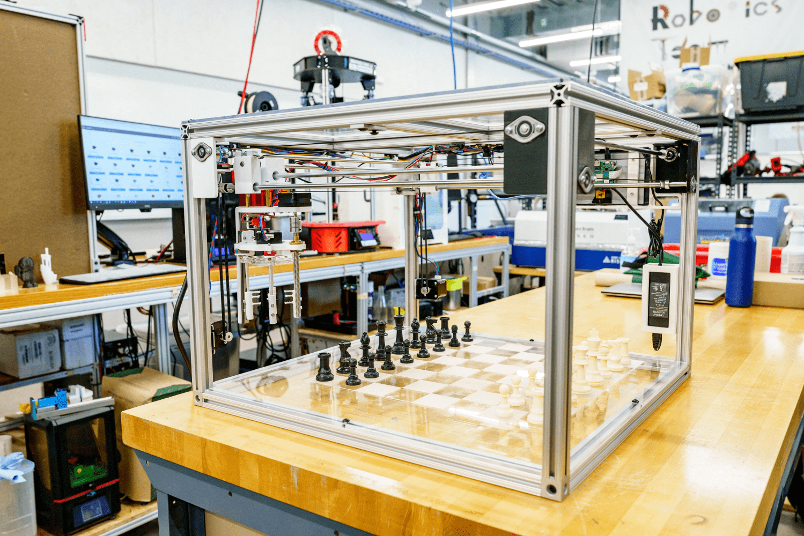
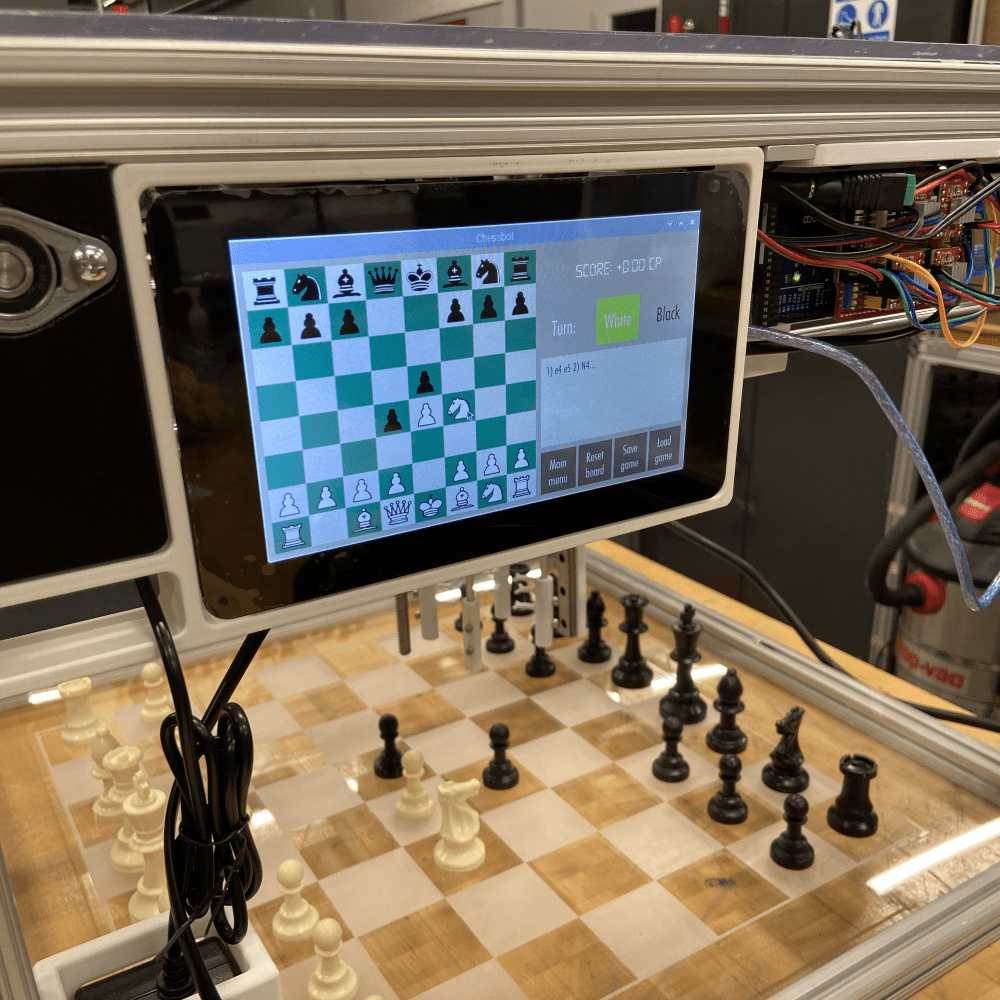

# ChessRobot
Chess-playing robot using Arduino and Raspberry Pi. See the [demo video](https://youtu.be/P3n7hMYIbRQ).



## Requirements
### Hardware

- Arduino Mega 2560 controller
- Raspberry Pi
- Raspberry Pi 7" display screen
- Raspberry Pi camera
- A Chessbot builder kit (earmarked for a much later date)

### Software

- Python 3.7+
- Arduino IDE
- Stockfish chess engine

Python dependencies:
```shell
kivy >= 2.0
chess >= 1.11
pyserial >= 3.0
pycamera >= 0.3
```

## Setup
This project is quite obsolete by now, but I am leaving some notes here for future work (as of 11/10/2024). So please take all setup instructions more as a "here's what I remember from 3 years ago" rather than gospel.

Generally, the setup is:

1. **Build the Chessbot** (glhf :chess_pawn:). This entails NEMA stepper motors and belts for a 2d gantry system (just like a 3d printer). The claw for picking up pieces is the hardest thing to get right. I'm considering the next iteration will use a magnetic gripper and custom-made chess pieces, or maybe even place the whole gantry [_underneath_](http://squareoffnow.com/) the board.
2. **Write the controller**. Using an Arduino, write a `.ino` file that takes commands to control all hardware (i.e. moving pieces around). See the `ChessController.ino` file. This could potentially be done all on the Raspberry pi instead.
3. **Run the Stockfish chess engine**. Write a Python script to run on the Raspberry pi that loads and interacts with the Stockfish engine (see the `chessbot_main.py` file). This script will also send all movement commands to the controller during a game via `pyserial`.
4. **Build a user interface**. To interact with Stockfish, use `kivy` to build a GUI that the user can interact with. This interface will show on the display screen during a game. See the `chessbot.kv` file.



## Future work
Given the existence of new commercialized "AI" [chess bots](http://squareoffnow.com/), I'm mainly keeping this repo as a personal hobby project. Some features I would like to include:

- A camera for detecting when/where pieces move. Might be easier/better to instead infer piece locations using sensors underneath the board.
- Better magnetic gripper
- Difficulty settings
- Chess engine that learns how to play at _your_ experience level
- Portable and miniaturized 
- Cheap to make, potentially as a toy buildable kit (rather than the expensive $600 bots you can buy online).